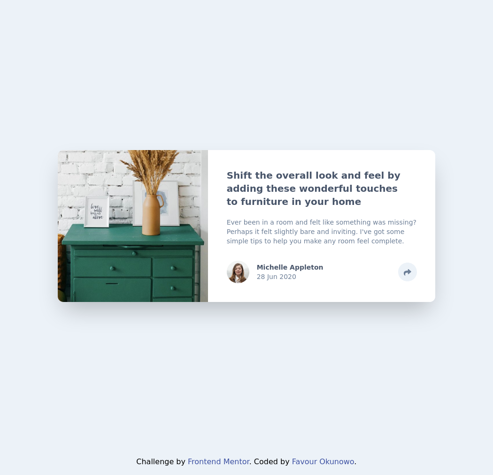
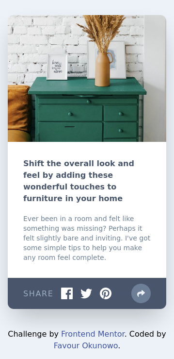

# Frontend Mentor - Article preview component solution

This is a solution to
the [Article preview component challenge on Frontend Mentor](https://www.frontendmentor.io/challenges/article-preview-component-dYBN_pYFT)
. Frontend Mentor challenges help you improve your coding skills by building realistic projects.

## Table of contents

- [Overview](#overview)
  - [The challenge](#the-challenge)
  - [Screenshot](#screenshot)
  - [Links](#links)
- [My process](#my-process)
  - [Built with](#built-with)
  - [What I learned](#what-i-learned)
  - [Useful resources](#useful-resources)
- [Author](#author)

## Overview

### The challenge

Users should be able to:

- View the optimal layout for the component depending on their device's screen size
- See the social media share links when they click the share icon

### Screenshot

### Links

- [Solution URL](https://github.com/nowodev/pages/tree/main/src/Pages/Challenges/Article_Preview_Card)
- [Live Site URL](https://pages-nowodev.netlify.app/challenges/article-preview)

## My process

### Built with

- Vue.js
- Tailwind CSS (Flex & Grid)
- Google Fonts
- Mobile-first workflow
- [Vue3 Popper](https://github.com/valgeirb/vue3-popper) - A Vue.js popover component based on PopperJS
- CSS custom properties

### What I learned

I learned how to add a color to an inline svg icon in tailwind css using the `fill-{color}` property

### Useful resources

- [Vue3 Popper](https://github.com/valgeirb/vue3-popper) - This helped me with the popper on medium+ screens
- [Tailwind Transition](https://tailwindcss.com/docs/transition-duration) - Used this property in setting the duration
  at which the share button background transitions in and out

## Author

- Website - [Favour Okunowo](https://www.nowodev.netlify.app)
- Frontend Mentor - [@nowodev](https://www.frontendmentor.io/profile/nowodev)
- Twitter - [@nowodev](https://www.twitter.com/nowodev)
