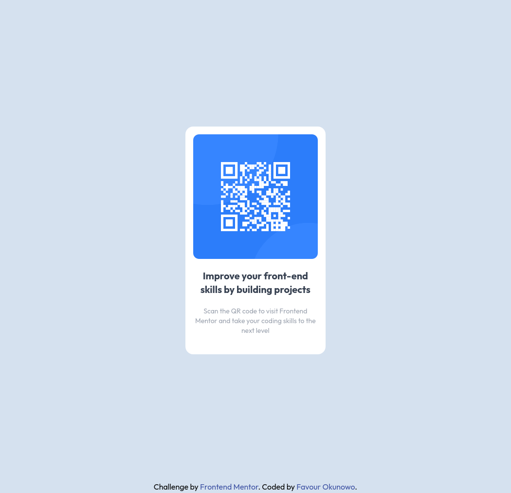

# Frontend Mentor - QR code component solution

This is a solution to
the [QR code component challenge on Frontend Mentor](https://www.frontendmentor.io/challenges/qr-code-component-iux_sIO_H)
. Frontend Mentor challenges help you improve your coding skills by building realistic projects.

## Table of contents

- [Overview](#overview)
  - [Screenshot](#screenshot)
  - [Links](#links)
- [My process](#my-process)
  - [Built with](#built-with)
  - [What I learned](#what-i-learned)
- [Author](#author)

**Note: Delete this note and update the table of contents based on what sections you keep.**

## Overview

### Screenshot



### Links

- [Solution URL](https://github.com/nowodev/pages/tree/main/src/Pages/Challenges/QRCode)
- [Live Site URL](https://pages-nowodev.netlify.app/challenges/qrcode)

## My process

### Built with

- Vue.js
- Tailwind CSS
- Google Fonts
- Mobile-first workflow

### What I learned

I discovered two methods of centering an element vertically

```html
<div class="flex w-full h-screen">
  <div class="flex justify-center m-auto">
    <!--  content goes here-->
  </div>
</div>
```

```html
<div class="flex w-full h-screen items-center justify-center">
  <!--  content goes here-->
</div>
```

## Author

- Website - [Favour Okunowo](https://www.nowodev.netlify.app)
- Frontend Mentor - [@nowodev](https://www.frontendmentor.io/profile/nowodev)
- Twitter - [@nowodev](https://www.twitter.com/yourusername)
