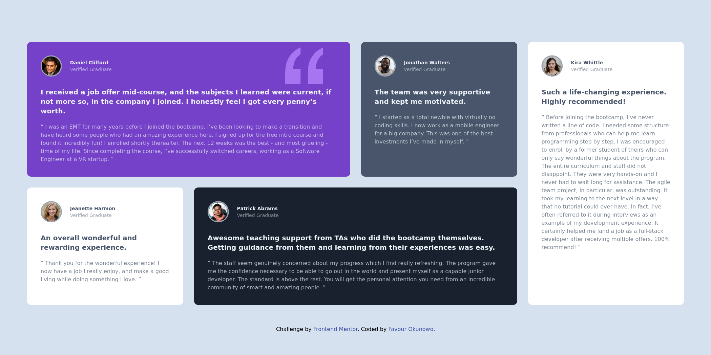

# Frontend Mentor - Testimonials grid section solution

This is a solution to
the [Testimonials grid section challenge on Frontend Mentor](https://www.frontendmentor.io/challenges/testimonials-grid-section-Nnw6J7Un7)
. Frontend Mentor challenges help you improve your coding skills by building realistic projects.

## Table of contents

- [Overview](#overview)
    - [The challenge](#the-challenge)
    - [Screenshot](#screenshot)
    - [Links](#links)
- [My process](#my-process)
    - [Built with](#built-with)
    - [What I learned](#what-i-learned)
    - [Useful resources](#useful-resources)
- [Author](#author)

## Overview

### The challenge

Users should be able to:

- View the optimal layout for the site depending on their device's screen size

### Screenshot




### Links

- [Solution URL](https://github.com/nowodev/pages/tree/main/src/Pages/Challenges/Testimonials)
- [Live Site URL](https://pages-nowodev.netlify.app/challenges/testimonials)

## My process

### Built with

- Vue.js
- Tailwind CSS
- Mobile-first workflow
- Tailwind CSS (Flex & Grid)
- Google Fonts

### What I learned

I learned how to re-order items when using grids

```html

<div class="grid grid-cols-4 ...">
  <div class="order-last">01</div>
  <div>02</div>
  <div class="order-first">03</div>
  <div class="order-2">04</div>
</div>
```

### Useful resources

- [Tailwind Flexbox & Grid Order](https://tailwindcss.com/docs/order) - Utilities for controlling the order of flex and
  grid items.

## Author

- Website - [Favour Okunowo](https://www.nowodev.netlify.app)
- Frontend Mentor - [@nowodev](https://www.frontendmentor.io/profile/nowodev)
- Twitter - [@nowodev](https://www.twitter.com/nowodev)